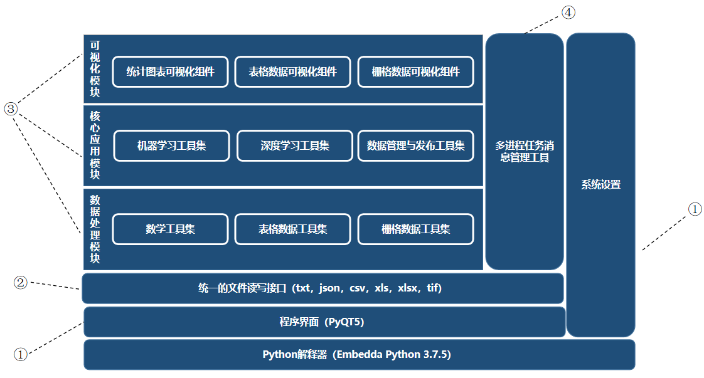
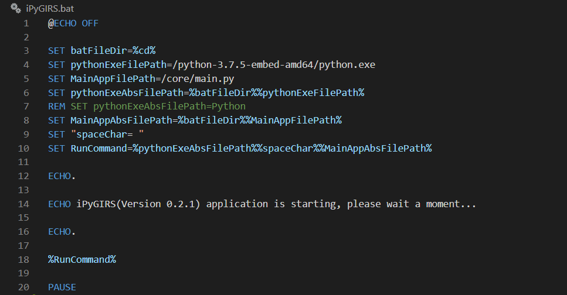
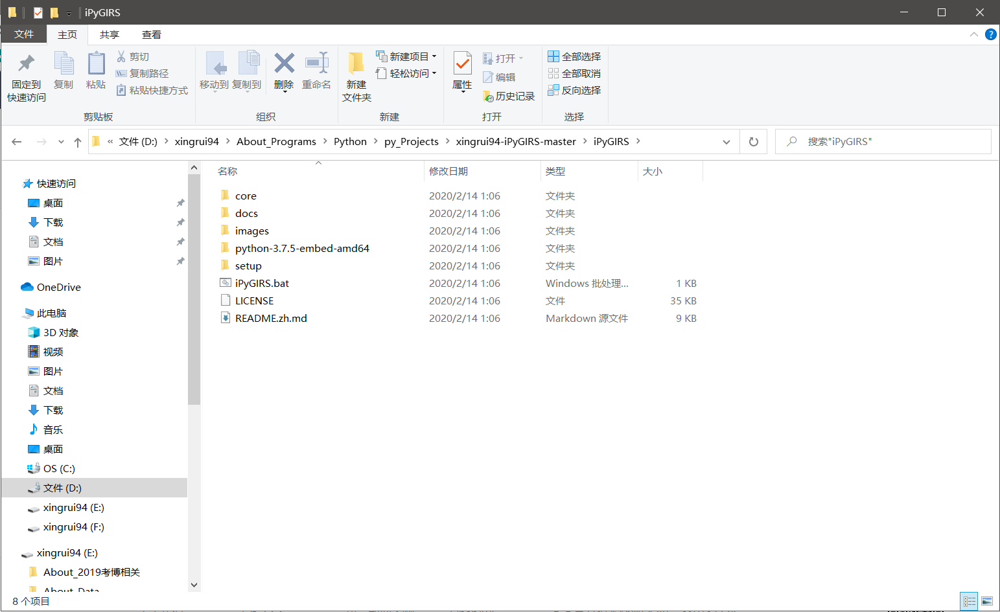
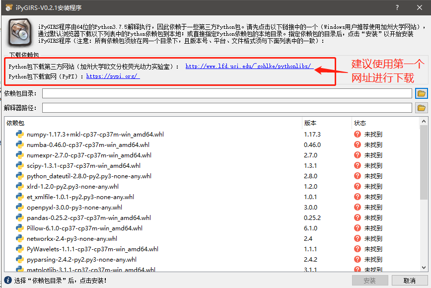
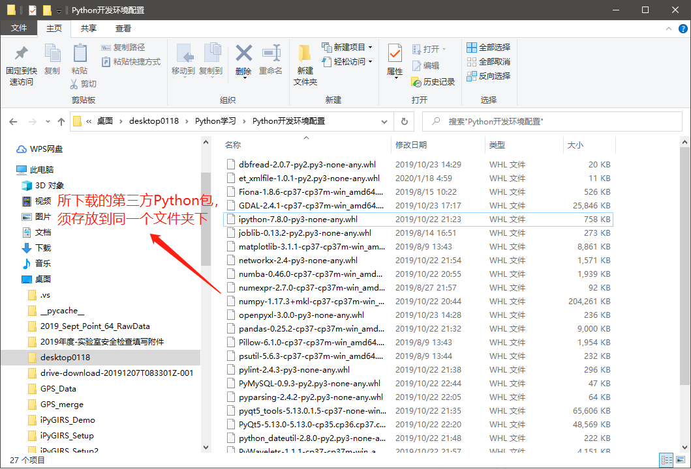
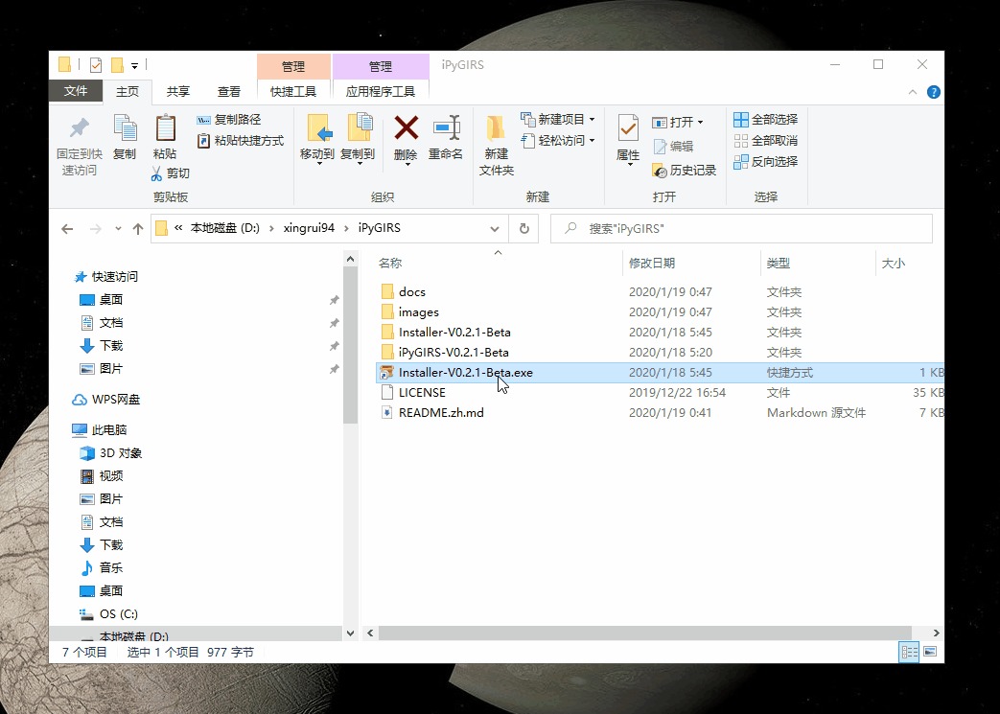

# iPyGIRS

## **1. 介绍**

<div align=center>


</div>

iPyGIRS，（iPy为前缀，说明该软件由作者喜爱的Python开发，GIRS是Geographic Information and Remote Sensing的缩写）是一个以栅格图像处理和机器学习建模为核心功能，集成了数据预处理、图表绘制、张量计算器、样本创建、像元值提取、波段分离、波段计算、图像融合、经验模型建模、方程应用、MySQL数据库管理、GeoServer数据发布等功能的软件。上图是iPyGIRS-V0.2.0-Beta软件的主界面，下图为iPyGIRS未来完工时所具备的功能示意图，目前仅有部分功能。该软件完全基于Python语言（版本3.7.5）开发，可应用于多种遥感监测研究中。目前公开的最新可用版本为V0.2.1-Beta，后续保持持续更新。


## **2. 软件架构**

iPyGIRS及其安装二进制程序完全基于Python开发，软件架构如下图所示。当程序启动时：

- ①首先启动“Python解释器”，读取程序的全局设置文件，随后加载主程序界面，显示给用户；

- ②“统一文件读写接口”准备就绪，可供“系统设置”工具、“多进程任务消息管理工具”、“各大工具集中的工具或组件”对本地磁盘进行读写操作；

- ③“各大工具集中的工具或组件”，首先读取全局配置文件中相应的工具属性设置，工具或组件被点击时，以“非模态窗口”显示给用户，数据则是通过“统一文件读写接口”传入；

- ④“多进程任务消息管理工具”在后台以独立进程运行，“各大工具集中的工具或组件”以“非模态窗口”显示，关闭后可在后台运行，运行中的错误、警告、成功等消息有该管理工具提供显示。



## **3. 最新版本及其更新内容**

**当前最新可用版本：V0.2.2**，通过本次更新，您将能更好地通过“scikit-learn机器学习”工具完成“分类”、“聚类”和“回归”机器学习的建模及参数调试任务 本版本的更新内容如下所示：

1. 解决“scikit-learn机器学习”工具的Bug。为此，新增了“机器学习模型类型选择”的页面，并在“设置参数”页面，当“参数类型”选择为“默认参数”时，该工具的“训练模型”页面的模型评价指标得分不会随参数的设置变化而改变。在“设置参数”页面，当“任务类型”选择为“分类”或“聚类”时，该工具的“训练模型”页面的模型评价指标会一直显示为“回归模型评价指标（R2、RMSE等）”，该版本已修复了该问题。此外，现在选择“分类”和“聚类”模型时，“模型评估图表”能正常显示“混淆矩阵图表”了。

## **4. 安装方法**

该软件目前只支持64位的Windows 7、Windows10系统，建议在以上两个系统环境下安装。（未来会推出Linux版本）这里推荐“使用系统中的Python作为解释器”和“使用嵌入式Python作为解释器”两种安装方式，无论哪中方式，您都需要先下载iPyGIRS项目文件。下载方法是，请点击项目主页（也即本页面）上的"**x个发行版**"链接，然后点击下载最新的源码文件“Source code.zip”。

- **使用系统中的Python作为解释器**

首先需要下载iPyGIRS项目文件下载到本地，并解压。如果您的操作系统中已经安装了Python和iPyGIRS所必须的包与模块（详见下文），则可以通过更改“iPyGIRS.bat”文件来直接启动iPyGIRS程序。修改方式是，如下图使用vs code或者其他文版编辑器打开“iPyGIRS.bat”文件，注销第6行代码，并取消第7行的注释即可。（**注意：Windows中bat文件的注释符号为“REM”**）也就是把第7行的“REM”剪切粘贴到第6行的最左边第一个字符位置即可！



- **使用嵌入式Python作为解释器**

如您的系统中没有安装Python，或者您需要将“iPyGIRS”程序复制给别人用，则建议使用嵌入式Python作为解释器。在所下载的文件中，存在文件夹——“python-3.7.5-embed-amd64”，这就是Python官方提供的嵌入式Python，此时您需要使用“setup”目录（文件夹）下的“setup.exe”程序来安装第三方包，具体步骤如下文所示：

### **（1）下载iPyGIRS项目文件**

将iPyGIRS项目文件下载到本地后解压，正确的文件目录结构应该如下所示：

``` file directory tree
|- iPyGIRS
    |- core
        |- appUI
        |- bin
        |- chart
        |- data
        |- fileIO
        |- MathLib
        |- model
        |- raster
        |- resource
        |- util
    |- docs
    |- images
    |- python-3.7.5-embed-amd64
    |- setup
    |- iPyGIRS.bat
    |- LICENSE
    |- README.zh.md
```



### **（2）下载第三方Python包**

双击“./iPyGIRS/setup/setup.exe”安装程序，即可看到下图的程序界面，点击程序界面中提供的两个网址，下载安装程序中所列出的第三方Python包，**所有的包须下载到同一个文件夹下！！！** 下表仅列出了iPyGIRS部分依赖包,推荐学习Python的小伙伴重点学习这些包的使用。





包名称|作用
:-|:-
numpy+mkl|为iPyGIRS中的表格数据处理、栅格数据处理，提供快速且强大的二维数组、矩阵的创建、运算功能
numba|为iPyGIRS中的nd-array数据（numpy）类型提供大幅加速功能
numexpr|符号运算库，为iPyGIRS提供符号运算功能，即字符、字符串当成内存可识别的计算公式
scipy|科学计算库，为iPyGIRS提供方程解算、最小二乘法优化算法、线性代数计算等功能
xlrd|为pandas提供xls格式的excel文件读写底层依赖
openpyxl|为pandas提供xlsx格式的excel文件读写底层依赖
pandas|为iPyGIRS程序提供excel、csv等文件的读写功能
matplotlib|为iPyGIRS程序提供散点图、折线图、直方图等统计图表绘制功能，且可以整合到PyQT5控件中显示
GDAL|为rasterio包提供底层依赖
rasterio|为iPyGIRS程序提供栅格数据文件的读写功能
PyMySQL|为iPyGIRS程序提供MySQL数据库的操作接口
joblib|为iPyGIRS程序提供大数据文件，内存数据磁盘缓存，保存至文件，并行计算功能
psutil|为iPyGIRS程序提供获取系统、电脑硬件信息的功能
scikit-learn|为iPyGIRS程序提供样本划分、特征选择、机器学习建模、训练、验证、测试、评估、绘制学习曲线等功能
PyQt5|QT5的Python封装，为iPyGIRS程序提供界面

### **（3）安装第三方Python包**

下载完所有第三方包后，使用“./iPyGIRS/setup/setup.exe”程序进行安装（**安装过程请确保电脑能够正常上网，因为虽然绝大多数第三方Python包已经下载到本地了，但部分第三方Python包仍须自行下载其它依赖包安装**）。该安装程序需要两个参数：

- 刚才所下载的第三方Python包的存放路径

- Python解释器的绝对路径（该Python解释器位于所下载的iPyGIRS程序文件中，相对路径为“./iPyGIRS/python-3.7.5-embed-amd64/python.exe”）。



## **5. 使用说明**

执行完安装程序后，根目录下将重新生成“iPyGIRS.bat”脚本文件，双击该文件即可运行程序。（由于是使用Windows cmd程序启动的iPyGIRS程序，因此，**除非你想退出程序，否则请勿关闭cmd黑色窗口**（可查看程序错误信息，未来的稳定版本，将会删除该窗口），这将导致程序被强制退出！）

1. 关于iPyGIRS的使用说明文档，可下载目录"./docs/iPyGIRS_V0.1.2_使用说明书.docx"中的word文档到本地查看，新版本的使用说明书会在将来的推出。

2. 当前版本使用过程中，如遇到程序奔溃，闪退，卡死未响应等情况，会在cmd
窗口（黑色窗口）中显示错误信息，请将相应的截图和用到的数据的情况，一起截图或提交到Issues,或通过邮箱直接联系我（xingrui94@163.com）。

## **6. 版本规划**

iPyGIRS的版本规划如下表所示，详细的版本规划，请参考版本规划文件“[./docs/开发日志与版本更新计划.md](./docs/开发日志与版本更新计划.md)”。**准确的更新时间、版本更新内容、计划变更以下一个版本实际发布更新时的信息为准。**
