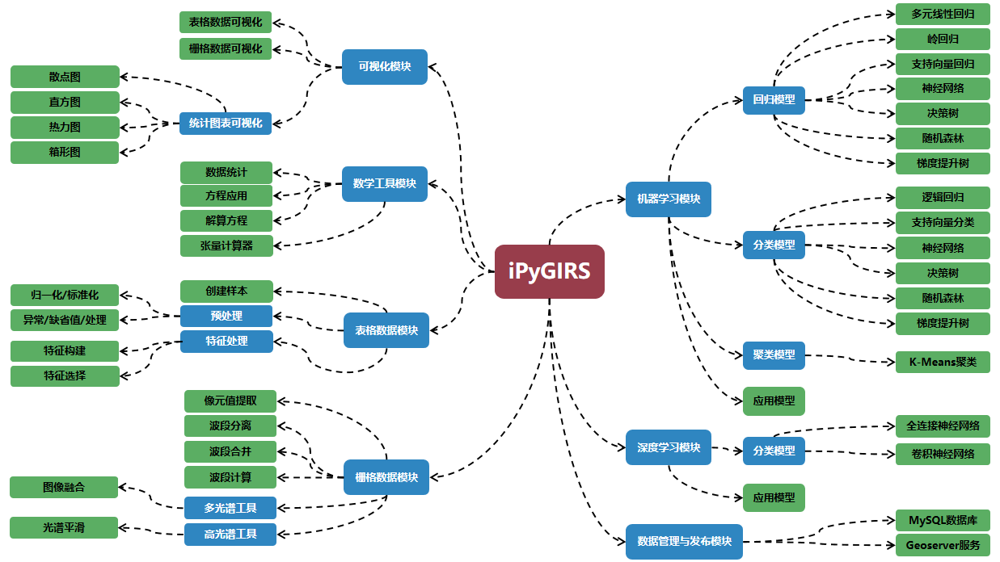

# iPyGIRS

## **介绍**


上图是iPyGIRS软件的主界面。如下图（该图为iPyGIRS未来完工时所具备的功能示意图，目前仅有部分功能）所示，iPyGIRS是一个以栅格图像处理和机器学习建模为核心功能，集成了数据预处理、图表绘制、张量计算器、样本创建、像元值提取、波段分离、波段计算、图像融合、经验模型建模、方程应用、MySQL数据库管理、GeoServer数据发布等功能的软件，该软件完全基于Python3.7.5语言开发，可应用于多种遥感监测研究中。目前公开的最新可用版本为V0.2.0-Beta，后续保持持续更新。



## **软件架构**

iPyGIRS完全基于Python开发，界面部分使用PyQT，包含了文件IO、数据预处理、栅格图像处理、机器学习、图表绘制等核心模块。具体的架构如下图所示：


## **安装方法**

该软件目前只支持64位的Windows 7及其以上版本的系统，建议使用64位Windows 7或Windows 10系统。

1. 从Python官网：[https://www.python.org/](https://www.python.org/)，下载嵌入式(绿色)版Python，即下载“Windows x86-64 embeddable zip file”链接下的文件;
2. 将下载的“Windows x86-64 embeddable zip file”解压到iPyGIRS根目录下，**须下载的3.7.5版本的embeddable Python**，则应该在如下图所示的目录中有“python-3.7.5-embed-amd64”文件夹。（**请务必，按照如下文件目录层次关系放置相应的文件**）

``` file directory tree

|- iPyGIRS
    |- iPyGIRS
        |- appUI
        |- bin
        |- chart
        |- data
        |- fileIO
        |- MathLib
        |- model
        |- python-3.7.5-embed-amd64
        |- raster
        |- resource
        |- util
    |- InstallPackages.bat
    |- iPyGIRS.bat
```

3. 为刚解压的文件夹中的嵌入式（embeddable）Python安装pip工具,具体的安装办法，可参考我的CSDN博客或简书，文章网址如下;

    [CSDN博客：https://blog.csdn.net/ScienceRui/article/details/103612099](https://blog.csdn.net/ScienceRui/article/details/103612099)

    [简书文章：https://www.jianshu.com/p/d4d40cb403d6](https://www.jianshu.com/p/d4d40cb403d6)

4. 使用刚安装的嵌入式（embeddable）Python的pip工具安装iPyGIRS所需的Python依赖包（**安装过程请确保电脑能够正常上网，因为下表列出的部分Python包仍须自行下载其它依赖包安装**）。依赖包的名称如表所示，安装脚本请使用“InstallPackages.bat”，具体使用方法，请参考上文中我的CSDN博客或简书。注意：GDAL与numpy+mkl均建议从第三方Python包网站——加州大学网站下载（Python官网的这两个包不一定符合iPyGIRS软件的要求）：[http://www.lfd.uci.edu/~gohlke/pythonlibs/](http://www.lfd.uci.edu/~gohlke/pythonlibs/),其中numpy，请务必下载numpy+mkl版本。

包名称|作用|版本
:-|:-|:-:
numpy+mkl|为iPyGIRS中的表格数据处理、栅格数据处理，提供快速且强大的二维数组、矩阵的创建、运算功能|1.17.3
numba|为iPyGIRS中的nd-array数据（numpy）类型提供大幅加速功能|0.46.0
numexpr|符号运算库，为iPyGIRS提供符号运算功能，即字符、字符串当成内存可识别的计算公式|2.7.0
scipy|科学计算库，为iPyGIRS提供，最小二乘法等优化算法功能|1.3.1
xlrd|为pandas提供xls格式的excel文件读写底层依赖|1.2.0
openpyxl|为pandas提供xlsx格式的excel文件读写底层依赖|3.0.0
pandas|为iPyGIRS程序提供excel、csv等文件的读写功能|0.25.2
matplotlib|为iPyGIRS程序提供散点图、折线图、直方图等统计图表绘制功能，且可以整合到PyQT5控件中显示|3.1.1
GDAL|为rasterio包提供底层依赖|2.4.1
rasterio|为iPyGIRS程序提供栅格数据文件的读写功能|1.0.24
PyMySQL|为iPyGIRS程序提供MySQL数据库的操作接口|0.9.3
joblib|为iPyGIRS程序提供大数据文件，内存数据磁盘缓存，保存至文件，并行计算功能|0.13.2
psutil|为iPyGIRS程序提供获取系统、电脑硬件信息的功能|5.6.3
scikit-learn|为iPyGIRS程序提供样本划分、特征选择、机器学习建模、训练、验证、测试、评估、绘制学习曲线等功能|0.21.3
PyQt5|QT5的Python封装，为iPyGIRS程序提供界面|5.13.0

## **使用说明**

双击根目录下的iPyGIRS.bat，即可运行程序。（由于是使用Windows cmd程序启动的iPyGIRS程序，因此，除非你想推出程序，否则请勿关闭cmd黑色窗口（可查看程序错误信息，未来的稳定版本，将会消除该窗口），这将导致程序被退出！）

1. 关于iPyGIRS的使用说明文档，可下载目录"./docs/iPyGIRS_V0.1.2_使用说明书.docx"中的word文档到本地查看，新版本（即v0.2.0）的使用说明书会在将来的推出。

2. 当前版本“V0.2.0”使用过程中，如遇到程序奔溃，闪退，卡死未响应等情况，会在cmd
窗口（黑色窗口）中显示错误信息，请将相应的截图和用到的数据的情况，一起截图或提交到Issues,或通过邮箱直接联系我（xingrui94@163.com）。

## **版本规划**

iPyGIRS的版本规划如下表所示，详细的版本规划，请参考“./docs/开发日志与版本更新计划.md”。

版本|预计推出时间|主要更新内容
:-:|:-:|:-
v0.2.1|2020.05~2020.06|主要修复v0.2.0版本中存在的系列bug，优化机器学习工具
v0.3.0|2020.05~2020.06|增加csv文件支持、图像融合、波段分离、合并、深度学习、机器学习模型测试等功能
v0.4.0|未定|机器学习可自动化多次训练、验证、测试。多进程技术加持，优化耗时的程序，增加程序后台处理功能。部分底层依赖修改。
v0.5.0|未定|重新设计程序主界面，具有更加丰富、漂亮的UI元素。增加表格数据显示、栅格数据显示功能，相应的操作面板上增加表格数据、栅格数据工具。增加文件格式转换功能（即csv、xlsx和hdf、tif、hdr的互相转换或单向转换功能）
v0.6.0|未定|增加表格数据、栅格数据的编辑、撤销、保存至文件、另存等功能
v0.7.0|未定|增加工具链功能，通过该功能，可拖到工具箱中的工具到面版，形成一个可定制的流程化工具集，底层依赖修改，API修改与优化
v0.1.0|未定|微调软件架构、程序数据存储方式和程序API，各方面设计趋于稳定
