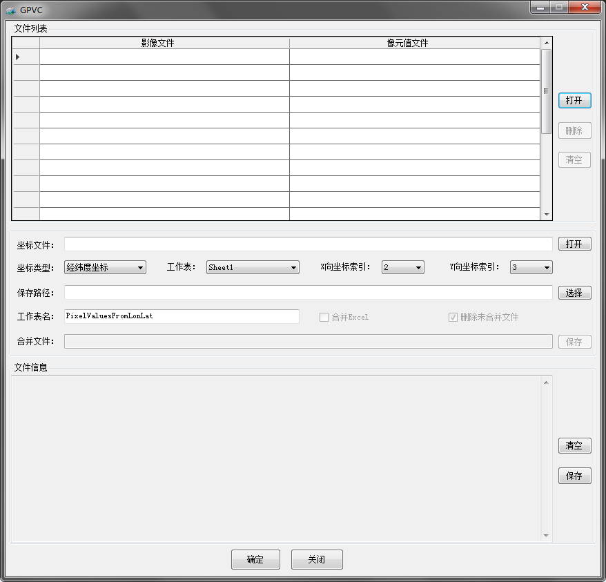
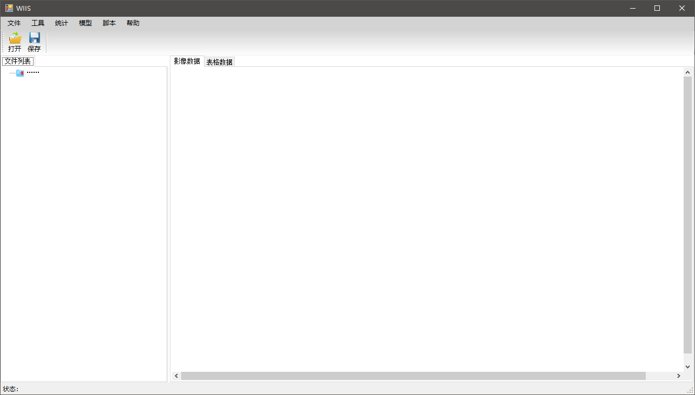
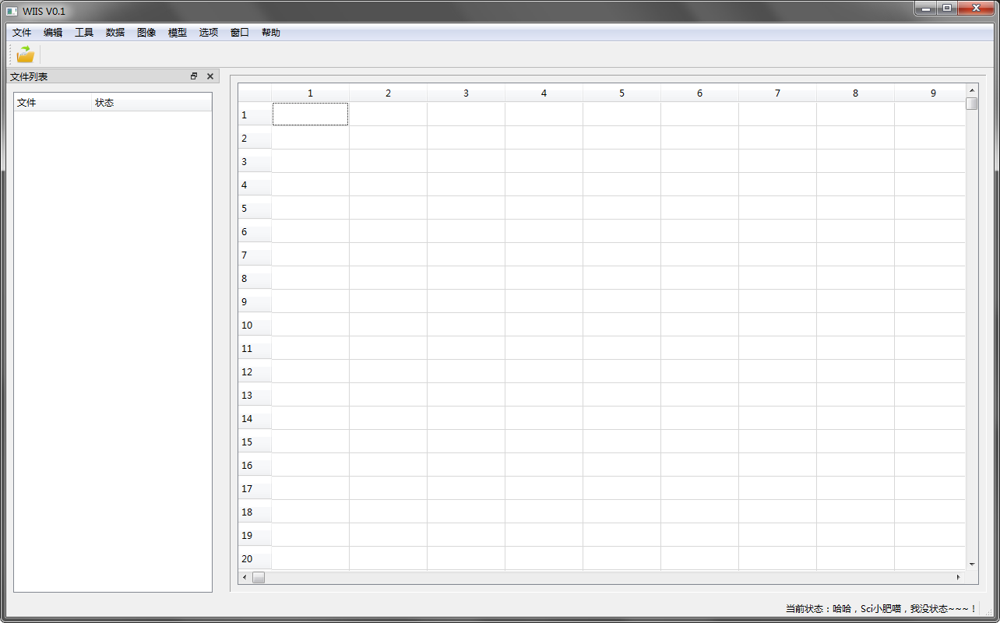
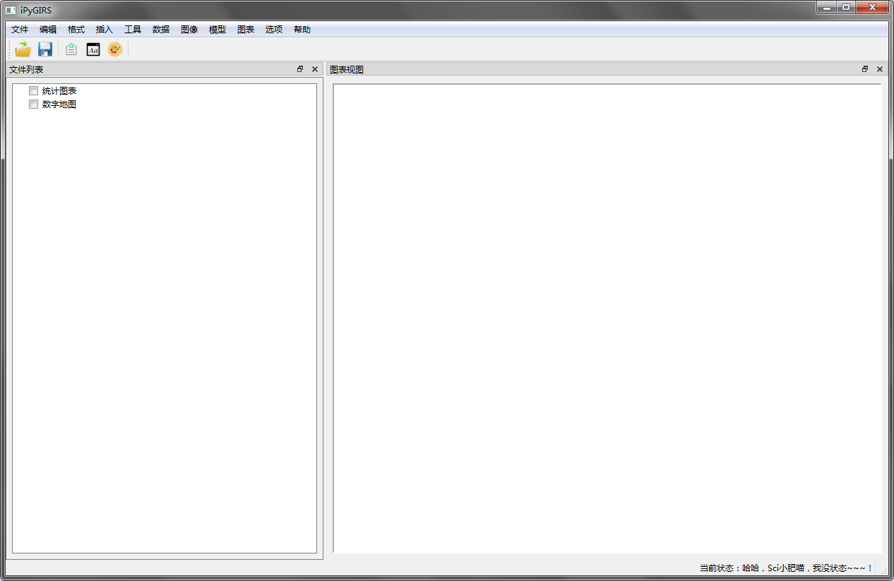
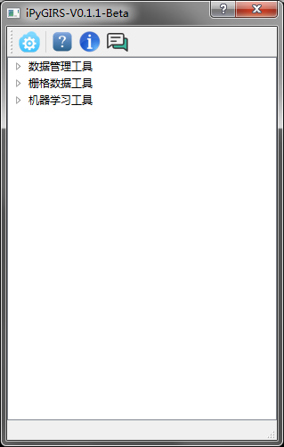
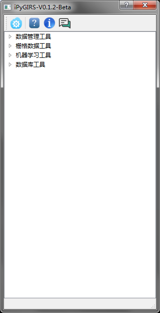
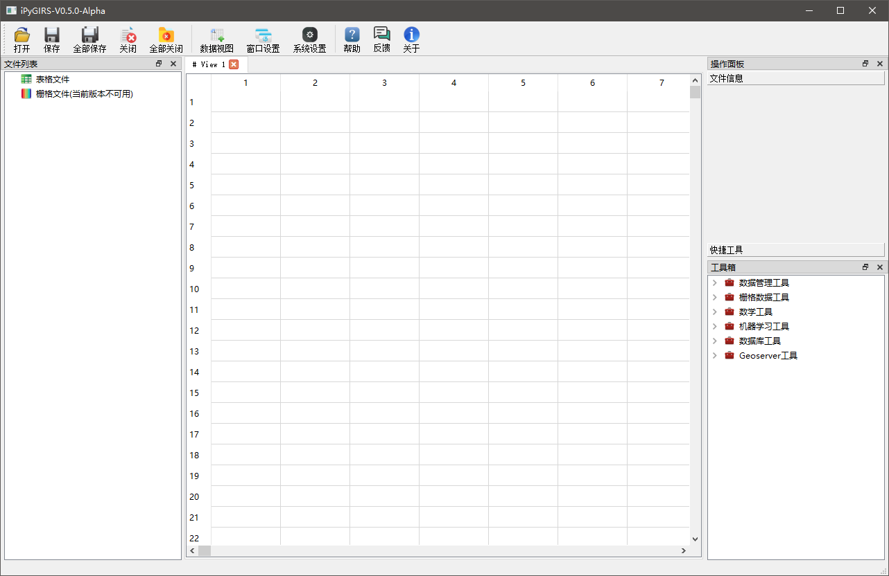

# **iPyGIRS软件开发日志与版本更新计划**

iPyGIRS（iPy为前缀，说明该软件由作者喜爱的Python开发，GIRS是Geographic Information and Remote Sensing的缩写）由GPVC和WIIS发展而来，是一个具有数据批量处理、机器学习模型自动调参、模型应用等特点的软件。该软件以栅格图像处理和机器学习建模为核心功能，集成了数据预处理、样本创建、像元值提取、波段计算、经验模型建模、方程应用、MySQL数据库、GeoServer数据发布等功能，可应用于多种遥感监测研究中。后续保持持续更新，目前最新可用版本为V0.2.0。关于iPyGIRS软件的详细介绍和开发日志详见下文。

- ## **【iPyGIRS软件前身 2018年5月-2019年1月】**

### **【GPVC V0.1.0】**

GPVC（Get Pixel Value From Coordinate）软件（仅是一个单独窗口），主要实现了像元值提取功能，基于.Net Framework平台，引用了自行编译的GDAL库和第三方编译的EPPlus库，从界面（WinForm）到程序逻辑完全采用C#编写，最终版本号:V1.1.0。

### **【WIIS V0.1.0】**

1.**Test WIIS阶段**

Test WIIS为WIIS（Water Index Inversion System）的测试阶段软件，该软件主要探索C#与Python之间互相调用的问题。程序界面部分依赖于.NET Framework生态体系，采用C#语言与WinForm技术开发。UI采用经典的菜单栏、工具栏、状态栏、文件列表和主对话窗口的形式。部分功能基于.Net Framework平台，引用了自行编译的GDAL库和第三方编译的EPPlus、MSChart库（微软）和Math.NET库实现；部分功能完全采用Python及其第三方包编写。整体上，采用后端进程的方式，从C#调用Python解释器来执行Python脚本从而实现相应的功能。

2.**WIIS01-WIIS04阶段**

由于机器学习库的限制，微软的开源机器学习库ML.Net仅支持.Net Core平台，而该平台不支持WinForm技术(当时微软尚未未发布支持WinForm的.NET Core3.0)，而开源机器学习库Accord.NET缺少部分算法，网上资源较少，帮助文档不够完善。综合上述因素，WIISV0.1.0，改由Python开发所有的界面和核心功能，该软件要主要实现了“样本创建”、“数据预处理”、“特征处理”、“图像融合”、“机器学习”、“应用模型”等功能。

> WIIS_01-WIIS_04经历WIIS_01、WIIS_02、WIIS_03、WIIS_04四种探索方案，为了解决编译、打包发布问题，从而让用户无需再独立安装配置Python并安装相关Python第三方模块，最终使用WinPython,在WinPython中使用pip工具安装好WIIS系统所有依赖的Python包后，编写了简单的主程序启动脚本，并使用Python第三方包——PyInstaller编译该脚本。启动脚本中仅调用Python标准库中的OS模块以执行操作系统的Shell命令，从而实现程序的启动。WIIS01到WIIS04阶段的最终版本版本号：V0.1.0。程序UI采用Python第三方包——PyQT5实现，沿用Test WIIS风格，依然采用经典的菜单栏、工具栏、状态栏、文件列表和主对话窗口的形式。

---

- ## **【iPyGIRS V0.1.0-Beta 2019年2月-2019年3月】:**

iPyGIRS软件的第一个版本V0.1.0，是在原的GPVC和WIIS基础上，重新设计系统，WIIS更名为“iPyGIRS”。程序UI沿用Test WIIS风格，依然采用经典的菜单栏、工具栏、状态栏、文件列表和主对话窗口的形式。在原GPVC的基础上，实现了以下功能：

1. 重新设计数据存储结构和相关程序模块的API接口，如栅格图像，Excel数据表采用Python字典存储；

2. “数据”菜单下，实现了“样本创建”、“特征构建”、“特征选择”3个功能；

3. “图像”菜单下，实现了“波段分离”、“波段融合”、“波段计算”、“STARFM图像融合”4个功能；

4. “模型”菜单下，在原“支持向量机”、“BP神经网络回归”、“随机森林回归”的基础上，进一步实现了“经验统计模型”，和其他机器学习模型：“线性回归”、“套索回归”、“Bagging回归”、“AdaBoost回归”、“梯度提升树回归”、“神经网络回归”、基于“Auto-sklearn”的“自动化机器学习”、“应用模型”等功能；

5. 系统实现了全新的“模型评估图表”可视化功能。

---

- ## **【iPyGIRS V0.1.1-Beta  2019年5月】:**

1. UI更新，全新设计的主界面UI，程序完全工具箱的形式呈现，所有功能集成到树状工具箱中，以此将所有开发精力集中到功能完善与Bug修复中；

2. 功能删减，由于操作逻辑与底层依赖的修改，暂时移除“波段分离”、“波段合并”、“波段计算”、“STARFM图像融合”4个工具；

3. 功能删减，由于底层依赖的修改，暂时移除“经验统计模型”工具；

4. 原菜单栏下“模型”——“机器学习模型”——“回归”所有模型合并到“回归模型”中，由一个界面完成模型训练、测试和数据保存，暂时移除对“套索回归”、“Bagging回归”、“AdaBoost回归”算法的实现。由于“auto-sklearn”严重依赖于“Linux”系统的部分系统组件，在“Windows”上只能使用虚拟机或Windows10的“WSL”运行此功能，因此，可能永远移除该工具。

---

- ## **【iPyGIRS V0.1.2-Beta  2019年5月（2019年5月20日  基于该版本申请软著）】:**

1. 修复“像元值提取”工具Bug；

2. 为了更好地确保数据的存储与读写序列正确性，栅格图像、Excel数据表的内存数据结构采用Python内建的有序字典存储（原为无序字典）。

---

- ## **【iPyGIRS V0.2.0-Beta  2019年8月-2019年10月】：**

1. UI更新，系统启用全新的Logo，各个工具也增加了相应的图标；

2. 功能更新，原“机器学习工具”——“回归模型”更新合并为“scikit-learn机器学习”（意味着以后将有基于不同机器学习库的机器学习工具推出）,该工具支持分类模型（逻辑回归、支持向量机、神经网络、决策树、随机森林、梯度提升树）和聚类模型（KMeans），同时在原有“回归模型”基础上，新增加了岭回归、套索回归、决策树回归模型；梯度提升树模型的底层依赖由LightGBM修改为sklearn；

3. 功能回归，“栅格数据工具”下恢复原版本中存在的“波段计算”工具，符号运算由原来的“sympy”改为“numexpr”；

4. 功能回归，工具箱新增加“数学工具”，恢复原版本中存在的“经验统计模型”工具，符号运算由原来的“sympy”改为“numexpr”；

5. 功能更新，“数学工具”下新增加“应用方程”工具；

6. 功能更新，工具箱新增加“Geoserver工具”，添加“发布WMS服务”功能；

7. 功能更新，工具箱新增加“数据库工具”，目前包含“MySQL数据库管理”工具，仅支持MySQl数据库的“更新”操作，同时支持更发布WMS服务；

8. 功能更新，系统新加入了“系统设置”功能，目前通过“系统设置”可设置系统的默认工作目录、MySQL与Geoserver的LocalHost与端口（后续将加入更多的程序设置功能选项）；

9. 程序数据存储格式，由xml文件改为json文件；

10. 修复大量Bug，提升系统稳定性。

注：该版本须大量测试“像元值提取”、“创建样本”、“归一化/标准化”、“特征构建”、“特征选择”、“scikit-learn机器学习”、“波段计算器”、“应用模型”8个工具的稳定性，以此基本实现机器学习流程所需的工具！后续，完成Bug修复，继续推出0.2.x系列版本，甚至是Release版本。

---

- ## **【iPyGIRS V0.2.1-Alpha  2020年05月-2020年06月】：**

1. 解决“scikit-learn机器学习”工具的Bug。在“调试参数”模式下，当K折交叉验证的的K值大于验证样本数时，程序会发生异常而奔溃，该版本已解决该问题，当错误的K值输入时，程序将出发弹窗报错以提醒用户纠正错误参数；

2. 解决“scikit-learn机器学习”工具的Bug。当手动关闭（取消操作）“scikit-learn机器学习”程序界面（主进程）后，子进程仍然在运行的问题（若无法解决，请在cmd运行窗口，使用Ctrl+C，强制停止进程运行）；

3. 解决“数据库工具”——“MySQL数据库管理工具”的bug，该bug导致TableWidget中Geoserver服务渲染图层名处于非第5列时，可能无法渲染图层的情况；

4. 优化“scikit-learn机器学习”工具。在“上一步”和“下一步”的操作中，若模型及其参数均为发生改变时，不再重新绘制学习曲线，而是从上一次绘制记录中读取学习曲线数据；

5. 优化“scikit-learn机器学习”工具。绘制模型评估图表时，画板能够自适应所显示的图表大小；

6. 解决主程序容易崩溃闪退问题。具体是，解决了多进程，子程序错误信息传递问题。在子进程程序崩溃时，可由主程序弹出错误信息窗口，以此提示用户进行参数修正；

---

- ## **【iPyGIRS V0.3.0-Alpha  2020年05月-2020年06月】：**

1. “栅格数据工具”细分为“多光谱工具”和“高光谱工具”；

2. 功能回归，“栅格数据工具”——“多光谱工具”下恢复对“波段分离”、“波段合并”、“STARFM图像融合”工具的完整支持；

3. 功能更新，“栅格数据工具”——“高光谱工具”下新增加“图像平滑”（移动平均算法）工具；

4. 功能更新，“机器学习工具”下新增加“模型测试”工具；

5. 功能更新，“机器学习工具”下新增加自动化学习程度更高的“TPOT机器学习”工具，丰富了该系统机器学习功能；

6. 功能更新，工具箱新增加“深度学习工具”，添加“全连接神经网络（FCNN）”、“卷积神经网络（CNN）”工具；

7. 功能更新，相关工具增加对“csv”文件格式的支持，对于大型Excel文件，为了提高数据读写效率，建议先转换为csv文件；

8. “像元值提取工具”程序逻辑小幅更新。现在，当设置像元半径大于0时，输出的像元值将会之平均值，而非以前的全部输出；

9. “scikit-learn机器学习”工具小幅更新。现在，在“参数调试”页面，增加各项参数的简要使用说明。此外，能在模型训练完毕后，立刻看到最优参数，在“训练”页面，当程序处于“调试参数”模式下时，模型训练完毕后，会显示最优参数；

10. 功能更新，系统“帮助”、反馈”和“关于”功能。通过“帮助”功能，可加载本地帮助文档，供用户查阅；通过“反馈”功能，可向指定邮件报送程序Bug或提供建议；通过“关于”功能，可查看本系统的开源协议、版权信息和作者信息等；此外，完善了“系统设置”功能，具有更多的选项设置；

11. 底层依赖修改，API保持不变。为了更好地自适应空单元格的处理，考虑到后期也可能基于pandas更新大量表格数据处理功能，因此，Excel文件的读写，采用Pandas（基于xlrd和openpyxl）替代原openpyxl模块；

12. 底层依赖修改，API保持不变。栅格图像读写，拟采用“GDAL”替代原“rasterio”；

13. 修复大量Bug，提升系统稳定性。

---

- ## **【iPyGIRS V0.4.0-Alpha  未定】：**

1. scikit-learn机器学习工具更新，新增加或优化现有功能为具有批量化训练、验证、测试的强大机器学习工具；

2. 功能更新，主程序新增加任务管理功能，工具箱中的耗时工具可后台执行，并实时反馈执行情况；

3. 系统优化，文件体积较大的栅格数据处理等文件，综合使用多线程技术和多进程（由于CPython GIL限制,而非多线程）技术，大幅提升IO密集型程序对大型数据的计算效率；

4. 系统优化，较为耗时的机器学习工具和深度学习工具，使用多进程技术优化；

5. 修复大量Bug，提升系统稳定性。

---

- ## **【iPyGIRS V0.5.0-Alpha  未定】：**

1. UI更新，全新设计的主界面UI（采用Ribbon风格），界面元素更加丰富和现代化。新增加文件列表、数据表格视图、工具箱、操作面板等界面；

2. 功能更新，文件列表新增加“数据表格视图”和“栅格数据视图”，方便对当前打开的文件进行分类显示；

3. 功能更新，操作面板，新增加对数据表格视图的“数据信息”、“方差分析”、“相关性分析”、“直方图统计”工具；

4. 功能更新，操作面板，新增加对“栅格数据视图”的“数据信息”、“直方图统计”工具；

5. 功能更新，工具箱新增加“文件管理”，添加“文件格式转换”工具；

6. 修复大量Bug，提升系统稳定性。

---

- ## **【iPyGIRS V0.6.0-Alpha  未定】：**

1. 功能更新，选项卡新增加“编辑功能”功能，可对表格数据和栅格数据进行编辑，并保存至文件；

2. 功能优化，丰富编辑功能的操作，经过修改的表格数据与栅格数据可撤销操作与恢复操作；

3. 修复大量Bug，提升系统稳定性。

---

- ## **【iPyGIRS V0.7.0-Alpha  未定  （不一定发布该版本，可能直接跳过，无限期推迟更新该版本所描述的功能）】：**

1. 功能更新，新增加“工具链”功能，可拖动工具箱工具到面板，组成工具链，解决批量化需求；

2. 修复大量Bug，提升系统稳定性。

---

- ## **【iPyGIRS V1.0.0-Alpha  未定】：**

1. 微调软件架构、程序数据存储方式和程序API，各方面设计趋于稳定；

2. 修复大量Bug，提升系统稳定性。
